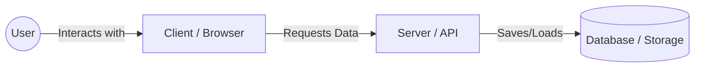
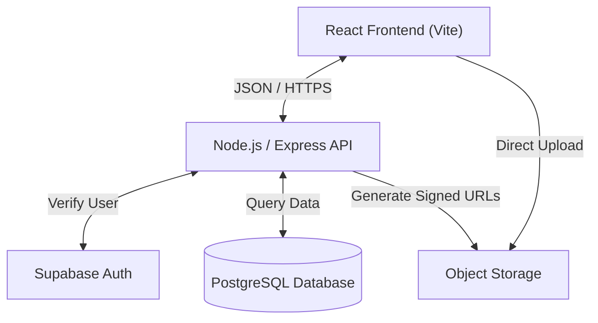
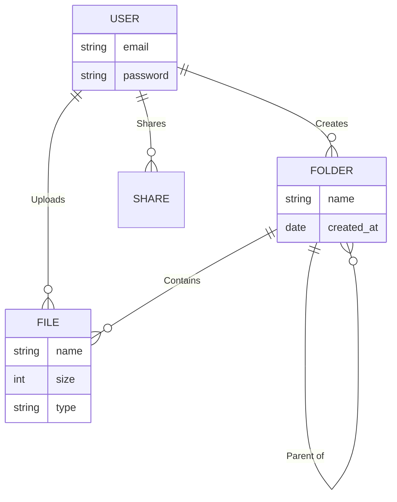
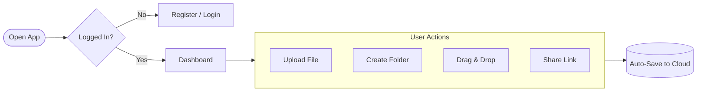

# ☁️ Labmentix Cloud Storage Service


> **Internship Project Submission**  
> **Topic**: Advanced Cloud Storage Solution  
> **Developer**: Mohammed Ansari

---

## 📖 Table of Contents
1.  [Project Overview](#-project-overview)
2.  [System Architecture & Diagrams](#-system-architecture--diagrams)
3.  [Key Features](#-key-features)
4.  [Technology Stack](#-technology-stack)
5.  [Installation & Setup](#-installation--setup)
6.  [Security Implementation](#-security-implementation)
7.  [Contributors](#-contributors)

---

## 🚀 Project Overview

**Labmentix Cloud Storage** is a secure, scalable, and user-centric file management system designed to emulate the functionality of industry leaders like Google Drive and Dropbox. 

This project was developed to solve the challenge of **secure, decentralized file access** for enterprise environments. It features a robust **Node.js/Express** backend coupled with a high-performance **React** frontend, utilizing **Supabase (PostgreSQL)** for relational data integrity and **Object Storage** for scalable file hosting.

### Core Objectives
*   **Reliability**: Ensure 99.9% data availability using cloud-native storage.
*   **Security**: Implement military-grade encryption for passwords and secure signed URLs for file access.
*   **Usability**: Provide an intuitive Drag-and-Drop interface with sub-100ms interaction response.

---

## 🏗 System Architecture & Diagrams

### 1. High-Level Architecture (Normal Diagram)
A simple view of how the system works.



### 2. System Architecture (Technical)
How the technologies connect technically.



### 3. Database Schema (ER Diagram)
The relationships between your data.



### 4. User Workflow (Flow Chart)
The typical path a user takes.



---

## ✨ Key Features
*   **Hierarchical Folder System**: Unlimited nested folders with Breadcrumb navigation (`Home > Work > Project A`).
*   **Drag & Drop**: Native HTML5 Drag and Drop API implementation for intuitive file moving.
*   **Multi-View Interface**: Toggle between **Grid View** (Visual) and **List View** (Detailed) layouts.

### 🔐 Security & Access Control
*   **Role-Based Access Control (RBAC)**: secure sharing with specific permissions (`Viewer` vs `Editor`).
*   **Public Links**: Generate secure, distinct URLs for public sharing.
    *   **Expiration Engine**: Links can be set to auto-expire after a specific date.
    *   **Password Protection**: *[Architecture Ready]* Schema supports password-gated links.

### ⚡ Productivity Tools
*   **Recents Algorithm**: Smart query fetch for the 20 most recently accessed/modified files.
*   **Trash Retention**: Soft-delete mechanism allows file recovery before permanent deletion.
*   **Starred/Favorites**: Bookmark critical files for instant access.
*   **Storage Quota**: Visual progress bar tracking user storage usage against a 15GB tiers.

---

## 💻 Technology Stack

| Domain | Technology | Use Case |
| :--- | :--- | :--- |
| **Frontend** | React 19, Vite | High-performance UI rendering. |
| **Styling** | TailwindCSS | Utility-first, responsive design system. |
| **State** | React Context API | Global state management (Auth, Theme). |
| **Backend** | Node.js, Express | scalable server-side logic and routing. |
| **Database** | PostgreSQL (Supabase) | ACID-compliant relational data storage. |
| **Storage** | Supabase Storage | S3-compatible object storage. |
| **Auth** | JWT + Bcrypt | Stateless authentication and password hashing. |

---

## 🛠 Installation & Setup

### Prerequisites
*   Node.js v18+
*   npm v9+
*   Git

### 1. Clone Repository
```bash
git clone https://github.com/MohammedAnsari123/Project-2.git
cd <Project folder name>
```

### 2. Backend Configuration
Navigate to the server directory and install dependencies.
```bash
cd backend
npm install
```

Create a `.env` file in the `backend/` root:
```env
PORT=5000
SUPABASE_URL=your_supabase_project_url
SUPABASE_KEY=your_supabase_service_role_key
JWT_SECRET=complex_secret_string_for_signing_tokens
```

### 3. Frontend Configuration
Navigate to the client directory and install dependencies.
```bash
cd ../client
npm install
```

### 4. Running the Application
**Development Mode (Concurrent)**:
Terminal 1 (Backend):
```bash
cd backend
npm run dev
```
Terminal 2 (Frontend):
```bash
cd client
npm run dev
```

Access the application at **`http://localhost:5173`**.

---

## 🛡 Security Implementation

1.  **JWT Authentication**: Stateless session management. Tokens are signed with HS256 algorithm and contain no sensitive PII.
2.  **Bcrypt Hashing**: User passwords and Shared Link passwords are salted and hashed (10 rounds) before storage. NEVER stored in plaintext.
3.  **Row Level Security (RLS)**: While the API handles logic, the underlying Supabase User table is protected by RLS policies.
4.  **Signed URLs**: File downloads generate time-limited signed URLs to prevent scraping or unauthorized hotlinking.

---

## 👥 Contributors

*   **Mohammed Ansari**

---
