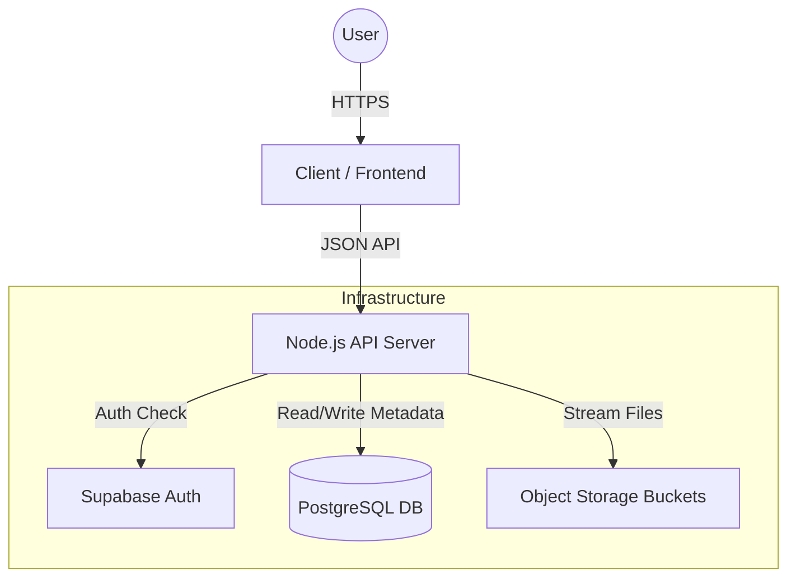

# Labmentix Cloud Storage


> **Submission for Internship Project**  
> **Topic**: Advanced Cloud Storage Solution  
> **Developer**: Mohammed Ansari

---

## 📋 Executive Summary

**Labmentix Cloud Storage** is an enterprise-grade file management system designed to replicate the core functionalities of industry-standard platforms like Google Drive and Dropbox. Engineered for scalability and security, it provides a centralized repository for digital assets with robust sharing capabilities.

This project demonstrates a full-stack implementation of a secure, cloud-native application, featuring **Role-Based Access Control (RBAC)**, **Real-time Storage Quotas**, and **Military-grade Encryption** for shared links.

---

## 🏗 System Architecture

The application is built on a decoupled **Client-Server Architecture**, ensuring separation of concerns and independent scalability.

### High-Level Design
The system orchestrates interactions between four key components:
1.  **Client (Frontend)**: A responsive SPA that handles user interactions and local state.
2.  **API Gateway (Backend)**: Middleware that enforces security, business logic, and request validation.
3.  **Identity Provider (Auth)**: Manages session tokens (JWT) and user identity.
4.  **Data Persistence (DB & Storage)**: Stores relational metadata and binary file objects.



### Database Schema
The data model is normalized to **3rd Normal Form (3NF)** to ensure integrity.

*   **Users**: Central identity table linked to Auth provider.
*   **Folders**: Self-referencing table supporting infinite nesting depth (`parent_id`).
*   **Files**: Metadata records linked to immutable storage objects.
*   **Shares**: Polymorphic permissions table handling both File and Folder access.
*   **LinkShares**: Tracks public share tokens, their expiry, and hashed passwords.

---

## ✨ Key Features

### 🔐 Security & Compliance
*   **Zero-Trust Password Storage**: All share link passwords are salted and hashed using **BCrypt** (12 rounds) before storage. 
*   **Time-Limited Access**: Public links support automated **Expiration Dates**, ensuring temporary access is revoked automatically.
*   **Row-Level Security (RLS)**: Database policies enforce strict data isolation; users can only query data they own or have been explicitly granted access to.

### 📂 Advanced File Management
*   **Dynamic Organization**: 
    *   **Nested Folders**: Create complex hierarchies with Breadcrumb navigation.
    *   **Drag-and-Drop**: Native HTML5 API integration for intuitive file uploads.
*   **Smart Navigation**:
    *   **Filtering**: Isolate files by type (Media, Documents, Archives).
    *   **Sorting**: Multi-column sorting (Name, Date, Size) with direction toggle.
*   **Trash & Recovery**: A comprehensive "Soft Delete" system allows users to restore accidentally deleted items within a retention window.

### 👥 Collaboration
*   **Granular Permissions**: Share resources with specific users as either `Viewer` (Read-only) or `Editor` (Read-Write).
*   **Secure Public Links**: Generate unique, cryptographically random links for external sharing, protected by optional passwords.

### 📊 Resource Management
*   **Live Quota Tracking**: Real-time storage calculation displaying usage in KB, MB, or GB.
*   **Tiered Storage Policies**:
    *   **Standard Plan**: 10 GB limit for regular users.
    *   **Enterprise Plan**: 2 TB limit for administrators.

---

## 💻 Technolgoy Stack

We utilized a modern, robust stack to ensure performance and maintainability.

| Layer | Technology | Key Libraries/Modules | Description |
| :--- | :--- | :--- | :--- |
| **Frontend** | **React 19** | `react-router-dom`, `lucide-react` | Component-based UI with client-side routing. |
| **Styling** | **TailwindCSS** | `postcss`, `autoprefixer` | Utility-first CSS for rapid, responsive design. |
| **Backend** | **Node.js** | `express`, `cors`, `helmet` | Event-driven runtime for scalable API services. |
| **Database** | **PostgreSQL** | `@supabase/supabase-js` | Relational database with real-time capabilities. |
| **Storage** | **S3 Storage** | - | Scalable object storage for binary files. |
| **Security** | **BCrypt** | `bcryptjs`, `jsonwebtoken` | Hashing algorithms and session token management. |

---

## 🛠 Installation Guide

Follow these steps to deploy the application locally.

### Prerequisites
*   **Node.js**: v18.0.0 or higher
*   **npm**: v9.0.0 or higher
*   **Git**: Latest version

### 1. Clone the Repository
```bash
git clone https://github.com/MohammedAnsari123/Project-2---Cloud-Based-storage-service---web.git
cd Project-2---Cloud-Based-storage-service---web
```

### 2. Backend Configuration
The backend serves as the bridge between the UI and the Database.

1.  Navigate to the backend directory:
    ```bash
    cd backend
    npm install
    ```
2.  Create a `.env` file for environment variables:
    ```env
    PORT=5000
    # Supabase Configuration
    VITE_SUPABASE_URL=your_project_url
    VITE_SUPABASE_KEY=your_anon_key
    SUPABASE_SERVICE_KEY=your_service_role_key
    # Security
    JWT_SECRET=your_secure_random_string
    ```
3.  Start the server:
    ```bash
    npm run dev
    ```

### 3. Frontend Configuration
The frontend provides the user interface.

1.  Open a new terminal and navigate to the client directory:
    ```bash
    cd client
    npm install
    ```
2.  Create a `.env` file:
    ```env
    VITE_API_URL=http://localhost:5000/api
    VITE_SUPABASE_URL=your_project_url
    VITE_SUPABASE_KEY=your_anon_key
    ```
3.  Launch the application:
    ```bash
    npm run dev
    ```

---

## 🛡 Future Roadmap

While the MVP is complete, the following features are planned for Phase 2:
*   [ ] **Version Control**: Maintaining history of file edits.
*   [ ] **Activity Logs**: Auditable trails of who accessed which file.
*   [ ] **Thumbnail Generation**: Server-side processing for image/video previews.
*   [ ] **Two-Factor Authentication (2FA)**: Additional security layer for login.
